# OpenWebUI Ollama DevOps Platform


Projet DevOps local permettant de déployer une plateforme de chatbot IA open source basée sur **Open WebUI** et **Ollama**.

Cette V1 propose un déploiement **100 % local**, sans dépendance cloud, avec deux modes de lancement :

* **Docker Compose** pour démarrer rapidement l’application sur une machine locale ;
* **Kubernetes local avec k3d et Helm** pour simuler une architecture cloud-native.

Le projet inclut également une base **GitHub Actions** permettant de tester automatiquement la configuration Docker Compose, le chart Helm et le déploiement Kubernetes dans un environnement temporaire GitHub.

> Ce projet ne fournit pas d’URL publique.
> Le déploiement est volontairement local : chaque utilisateur clone le repository et lance l’application sur sa propre machine.
> GitHub Actions sert à valider automatiquement les fichiers Docker, Helm et le déploiement Kubernetes dans un runner temporaire GitHub.

---

## Sommaire

* [Objectif du projet](#objectif-du-projet)
* [Ce que démontre ce projet](#ce-que-démontre-ce-projet)
* [Architecture locale](#architecture-locale)
* [Stack technique](#stack-technique)
* [Structure du repository](#structure-du-repository)
* [Prérequis](#prérequis)
* [Déploiement 1 : Docker Compose](#déploiement-1--docker-compose)
* [Déploiement 2 : Kubernetes local avec k3d et Helm](#déploiement-2--kubernetes-local-avec-k3d-et-helm)
* [GitHub Actions](#github-actions)
* [Captures d’écran](#captures-décran)
* [Commandes de nettoyage](#commandes-de-nettoyage)
* [Sécurité et bonnes pratiques](#sécurité-et-bonnes-pratiques)
* [Roadmap](#roadmap)
* [Auteur](#auteur)

---

## Objectif du projet

L’objectif est de démontrer la mise en place d’une application IA self-hosted avec une approche DevOps locale, reproductible et documentée.

Open WebUI est utilisé comme application open source de référence.
La valeur principale de ce repository repose sur la partie DevOps :

* conteneurisation avec Docker ;
* orchestration Kubernetes locale avec k3d ;
* packaging applicatif avec Helm ;
* gestion de la persistance avec des volumes ;
* automatisation des validations avec GitHub Actions ;
* documentation technique claire et reproductible.

Ce projet ne vise pas à revendiquer la création d’Open WebUI.
Il vise à montrer comment industrialiser et documenter son déploiement dans un contexte DevOps.

---

## Ce que démontre ce projet

Cette V1 permet de démontrer plusieurs compétences DevOps :

* créer un environnement local reproductible ;
* déployer une application avec Docker Compose ;
* déployer la même application sur Kubernetes local ;
* créer et valider un chart Helm ;
* gérer des services Kubernetes, deployments et volumes persistants ;
* automatiser les contrôles avec GitHub Actions ;
* documenter un projet de façon exploitable par un autre utilisateur.

---

## Architecture locale

```text
Utilisateur
   |
   | http://localhost:3000
   | ou
   | http://localhost:3001
   v
Open WebUI
   |
   | OLLAMA_BASE_URL
   v
Ollama
   |
   v
Modèle local : llama3.2:1b
```

Deux modes de déploiement sont disponibles :

```text
Mode 1 : Docker Compose
Utilisateur -> localhost:3000 -> Open WebUI -> Ollama

Mode 2 : Kubernetes local
Utilisateur -> localhost:3001 -> port-forward -> Service Kubernetes -> Pod Open WebUI -> Service Ollama -> Pod Ollama
```

---

## Stack technique

| Domaine                  | Outils              |
| ------------------------ | ------------------- |
| Application IA           | Open WebUI          |
| Moteur IA local          | Ollama              |
| Modèle de démonstration  | llama3.2:1b         |
| Conteneurisation         | Docker              |
| Déploiement local rapide | Docker Compose      |
| Orchestration locale     | Kubernetes avec k3d |
| Packaging Kubernetes     | Helm                |
| CI/CD                    | GitHub Actions      |
| Système cible            | Local machine       |

---

## Structure du repository

```text
.
├── .github/
│   └── workflows/
│       ├── ci.yml
│       └── k3d-deploy-test.yml
├── kubernetes/
│   └── helm/
│       └── openwebui-ollama/
│           ├── Chart.yaml
│           ├── values.yaml
│           ├── values-local.yaml
│           └── templates/
│               ├── _helpers.tpl
│               ├── ollama-deployment.yaml
│               ├── ollama-model-job.yaml
│               ├── ollama-pvc.yaml
│               ├── ollama-service.yaml
│               ├── openwebui-deployment.yaml
│               ├── openwebui-pvc.yaml
│               └── openwebui-service.yaml
├── screenshots/
├── scripts/
│   └── local/
├── .env.example
├── .gitignore
├── docker-compose.yml
└── README.md
```

---

## Prérequis

Avant de lancer le projet, installer les outils suivants :

### Obligatoire pour Docker Compose

* Git
* Docker Desktop
* Docker Compose

### Obligatoire pour Kubernetes local

* Docker Desktop
* kubectl
* Helm
* k3d

Vérifier les versions :

```bash
docker --version
docker compose version
kubectl version --client
helm version
k3d version
```

---

## Déploiement 1 : Docker Compose

Ce mode est le plus simple.
Il permet de lancer Open WebUI et Ollama directement en local avec Docker Desktop.

### 1. Cloner le repository

```bash
git clone https://github.com/luigitms/openwebui-ollama-devops.git
cd openwebui-ollama-devops
```

### 2. Créer le fichier d’environnement local

```bash
cp .env.example .env
```

Le fichier `.env.example` contient les variables suivantes :

```env
OPENWEBUI_PORT=3000
OLLAMA_PORT=11434
WEBUI_AUTH=true
OLLAMA_MODEL=llama3.2:1b
```

Le fichier `.env` ne doit pas être versionné dans Git.

### 3. Vérifier la configuration Docker Compose

```bash
docker compose -f docker-compose.yml config
```

Cette commande permet de vérifier que le fichier `docker-compose.yml` est valide.

### 4. Lancer l’application

```bash
docker compose up -d
```

### 5. Vérifier les conteneurs

```bash
docker ps
```

Les conteneurs attendus sont :

```text
openwebui
openwebui-ollama
openwebui-ollama-model-init
```

Le conteneur `openwebui-ollama-model-init` sert à télécharger le modèle Ollama.
Il peut se terminer après le téléchargement du modèle, ce qui est normal.

### 6. Accéder à Open WebUI

Ouvrir le navigateur à l’adresse suivante :

```text
http://localhost:3000
```

### 7. Vérifier le modèle Ollama

```bash
docker exec -it openwebui-ollama ollama list
```

Le modèle attendu est :

```text
llama3.2:1b
```

### 8. Arrêter Docker Compose

```bash
docker compose down
```

Ne pas utiliser `docker compose down -v` si vous souhaitez conserver les volumes et les données locales.

---

## Déploiement 2 : Kubernetes local avec k3d et Helm

Ce mode permet de déployer Open WebUI et Ollama dans un cluster Kubernetes local.

Il est plus représentatif d’un vrai environnement DevOps, car il utilise :

* un cluster Kubernetes local ;
* des deployments ;
* des services ;
* des persistent volume claims ;
* un chart Helm ;
* un port-forward pour accéder à l’application.

---

### 1. Créer le cluster k3d

```bash
k3d cluster create openwebui-local --agents 1
```

### 2. Vérifier les nodes Kubernetes

```bash
kubectl get nodes
```

Les nodes doivent être en statut :

```text
Ready
```

---

### 3. Valider le chart Helm

```bash
helm lint ./kubernetes/helm/openwebui-ollama
```

Résultat attendu :

```text
1 chart(s) linted, 0 chart(s) failed
```

---

### 4. Générer les manifests Kubernetes sans déployer

```bash
helm template openwebui ./kubernetes/helm/openwebui-ollama -f ./kubernetes/helm/openwebui-ollama/values-local.yaml
```

Cette commande permet de vérifier le rendu Kubernetes généré par Helm.

---

### 5. Déployer avec Helm

```bash
helm upgrade --install openwebui ./kubernetes/helm/openwebui-ollama \
  -n openwebui \
  --create-namespace \
  -f ./kubernetes/helm/openwebui-ollama/values-local.yaml \
  --timeout 20m
```

Le timeout est volontairement augmenté, car le téléchargement du modèle Ollama peut prendre plusieurs minutes.

---

### 6. Vérifier la release Helm

```bash
helm list -n openwebui
```

Résultat attendu :

```text
STATUS: deployed
```

Vérifier le statut détaillé :

```bash
helm status openwebui -n openwebui
```

---

### 7. Vérifier les pods

```bash
kubectl get pods -n openwebui
```

Pods attendus :

```text
openwebui-ollama-ollama
openwebui-ollama-openwebui
```

Ils doivent être en statut :

```text
Running
```

---

### 8. Vérifier les services

```bash
kubectl get svc -n openwebui
```

Services attendus :

```text
openwebui-ollama-ollama
openwebui-ollama-openwebui
```

---

### 9. Vérifier les volumes persistants

```bash
kubectl get pvc -n openwebui
```

PVC attendus :

```text
openwebui-ollama-ollama-data
openwebui-ollama-openwebui-data
```

Ils doivent être en statut :

```text
Bound
```

---

### 10. Accéder à Open WebUI via Kubernetes

Comme le service est de type `ClusterIP`, il n’est pas exposé directement sur la machine locale.
On utilise donc un port-forward :

```bash
kubectl port-forward -n openwebui svc/openwebui-ollama-openwebui 3001:8080
```

La commande reste active dans le terminal.
C’est normal : elle maintient le tunnel ouvert entre la machine locale et le service Kubernetes.

Ouvrir ensuite :

```text
http://localhost:3001
```

Pour arrêter le port-forward :

```text
CTRL + C
```

---

### 11. Vérifier le modèle Ollama dans Kubernetes

```bash
kubectl exec -n openwebui deploy/openwebui-ollama-ollama -- ollama list
```

Résultat attendu :

```text
llama3.2:1b
```

---

## GitHub Actions

Le projet contient deux workflows GitHub Actions.

```text
.github/workflows/ci.yml
.github/workflows/k3d-deploy-test.yml
```

---

### Workflow 1 : CI

Le workflow `CI` vérifie automatiquement :

* la structure du repository ;
* la validité du fichier Docker Compose ;
* la validité du chart Helm ;
* le rendu des manifests Kubernetes avec `helm template`.

Il est déclenché automatiquement sur :

* push sur `main` ;
* pull request vers `main` ;
* lancement manuel avec `workflow_dispatch`.

---

### Workflow 2 : K3D Deploy Test

Le workflow `K3D Deploy Test` crée un cluster Kubernetes temporaire dans un runner GitHub Actions.

Il effectue les actions suivantes :

```text
1. Checkout du repository
2. Installation de kubectl
3. Installation de Helm
4. Installation de k3d
5. Création d’un cluster k3d temporaire
6. Validation du chart Helm
7. Déploiement du chart Helm
8. Vérification des deployments Kubernetes
9. Vérification des ressources Kubernetes
10. Test de disponibilité du service Open WebUI dans le cluster
11. Suppression du cluster k3d
```

Dans la CI, le téléchargement automatique du modèle Ollama est désactivé avec :

```bash
--set modelInit.enabled=false
```

Cela permet d’éviter un téléchargement long et inutile dans le runner GitHub.
Le téléchargement du modèle est validé en local dans les déploiements Docker Compose et Kubernetes.

---

### Important : différence entre GitHub Actions et le local

GitHub Actions ne déploie pas l’application sur votre PC.

Lorsqu’un workflow s’exécute, GitHub crée une machine temporaire appelée runner.
Le `localhost` du runner GitHub est différent du `localhost` de votre ordinateur.

Donc :

```text
localhost:3000 sur votre PC ≠ localhost:3000 dans GitHub Actions
```

GitHub Actions sert à prouver que le projet est automatiquement testable et reproductible.
Pour utiliser réellement l’application, l’utilisateur doit cloner le repository et lancer le déploiement sur sa propre machine.

---

## Captures d’écran

Les captures d’écran du projet sont disponibles dans le dossier :

```text
screenshots/
```

### Docker Compose


### Helm et Kubernetes local

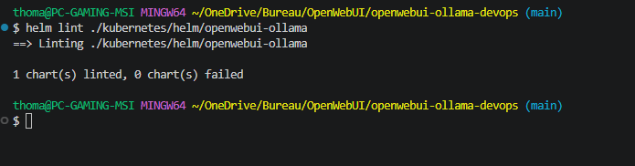

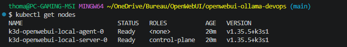

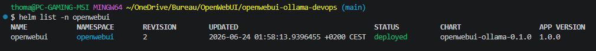

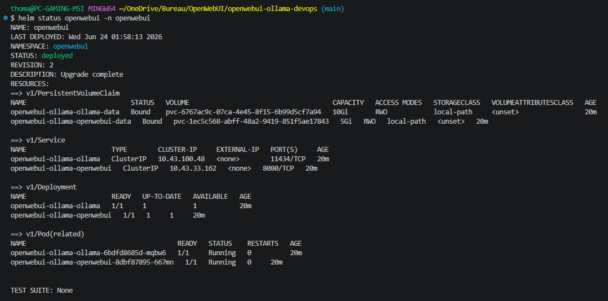

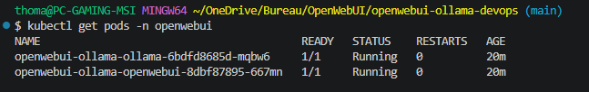

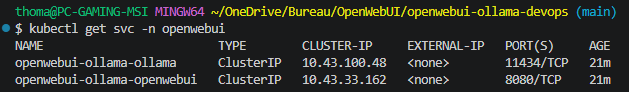

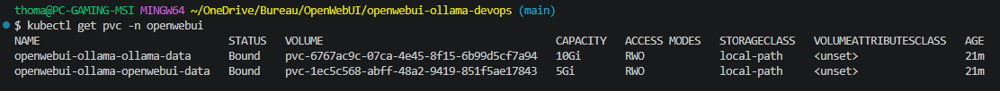

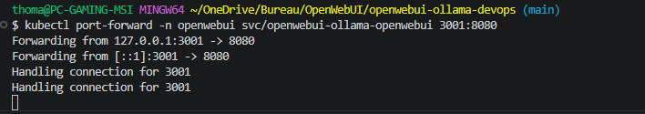

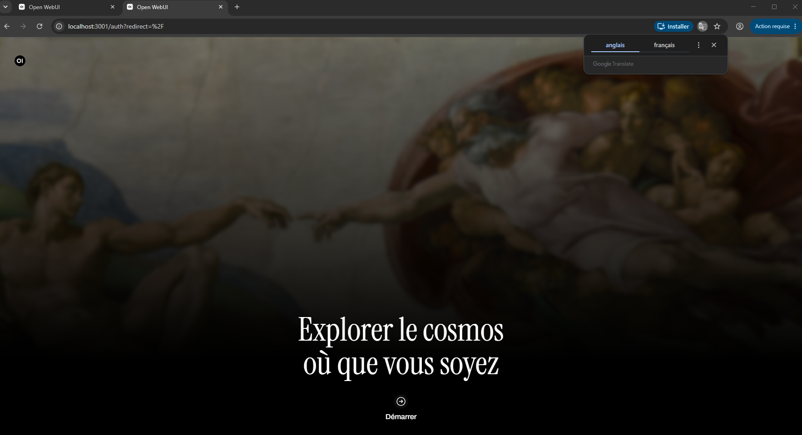

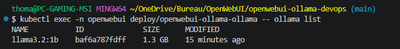

### GitHub Actions

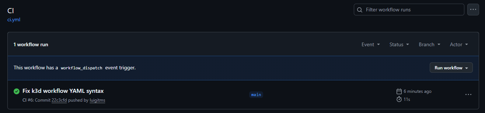

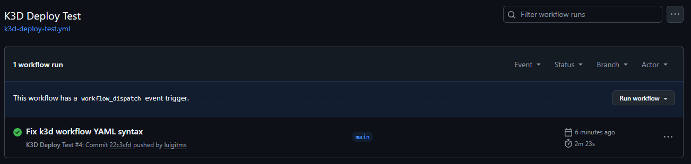

---

## Commandes de nettoyage

### Arrêter Docker Compose

```bash
docker compose down
```

### Supprimer la release Helm

```bash
helm uninstall openwebui -n openwebui
```

### Supprimer le namespace Kubernetes

```bash
kubectl delete namespace openwebui
```

### Supprimer le cluster k3d

```bash
k3d cluster delete openwebui-local
```

---

## Sécurité et bonnes pratiques

Bonnes pratiques appliquées dans cette V1 :

* aucun secret stocké dans le repository ;
* fichier `.env.example` fourni comme modèle ;
* fichier `.env` ignoré par Git ;
* chart Helm séparé du déploiement Docker Compose ;
* volumes persistants utilisés pour conserver les données ;
* validation automatique via GitHub Actions ;
* déploiement local sans coût cloud.

---

## Limites de la V1

Cette V1 est volontairement locale.

Elle ne fournit pas encore :

* d’URL publique ;
* de nom de domaine ;
* de certificat HTTPS ;
* de Load Balancer cloud ;
* de déploiement Terraform ;
* de cluster managé AWS, Scaleway ou Azure ;
* de monitoring Prometheus/Grafana complet.

Ces éléments pourront être ajoutés dans une V2.

---

## Roadmap

* [x] Créer la structure du projet
* [x] Ajouter le déploiement Docker Compose
* [x] Ajouter le téléchargement automatique d’un modèle Ollama
* [x] Ajouter le chart Helm
* [x] Ajouter le déploiement Kubernetes local
* [x] Ajouter les captures d’écran
* [x] Ajouter GitHub Actions
* [x] Tester automatiquement Docker Compose et Helm
* [x] Tester automatiquement un déploiement k3d dans GitHub Actions
* [x] Rédiger le README final de la V1
* [ ] Préparer une V2 cloud AWS

---

## Roadmap V2 AWS

Une future version pourra intégrer un déploiement cloud optionnel avec :

* Terraform ;
* AWS EKS ;
* AWS ECR ;
* Load Balancer AWS ;
* Ingress Controller ;
* HTTPS ;
* variables d’environnement par environnement ;
* GitHub Actions avec déploiement cloud manuel ;
* documentation FinOps pour éviter les coûts inutiles.

L’objectif de la V2 sera de passer d’un déploiement local reproductible à un déploiement cloud public, sécurisé et automatisé.

---

## Auteur

Projet réalisé par **Luigi THOMAS** dans le cadre d’un portfolio DevOps orienté infrastructure, automatisation, Kubernetes et déploiement d’applications IA self-hosted.

---

## Crédits

Open WebUI est un projet open source utilisé comme application support.
Ollama est utilisé pour exécuter un modèle IA localement.

Ce repository se concentre sur la partie DevOps : déploiement, orchestration, packaging, automatisation et documentation.